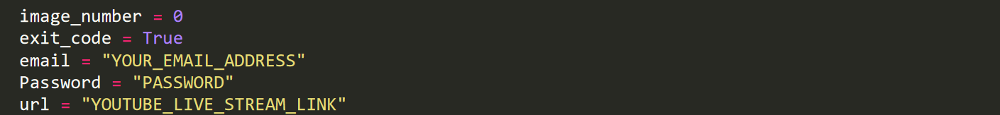
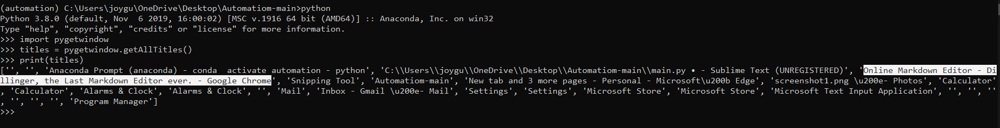

# National Education Policy Automation
### Ft. Galgotias University
## Requirements
```sh
python 3.8
selenium
pyautogui
PIL
```
### Run : ```pip install -r "requirements.txt"```

# How to run



1.```Put your email address, password and video link corresponding to the appropriate varibales name```
### Video Links
```sh
Day-1 YouTube Live Link: https://youtu.be/FHSrEThvtZs
Day-2 YouTube Live Link: https://youtu.be/FWPUY_8EhA8
```

> Open the YouTube video in a ```separate chrome tab``` and make sure there should be ```only one tab``` i.e. of YouTube video itself.

2.Open the ```python shell```. Run the following command 


Now there must be a ```youtube window name``` copy that and paste it in front of ```window_name```

3.Now close the chrome window.

### OR - You can place these window name in front of ```window_name``` variable, it should work as well
```sh
Day-1 : (69) Inaugural Session: Two days National Seminar on NEP 2020: A Gateway to Academic Excellence - YouTube - Google Chrome
Day-2 : (69) Day-2 Plenary Talks: Track: Quality Improvement in Research - YouTube - Google Chrome
```


4.Run ```pyhton main.py```
